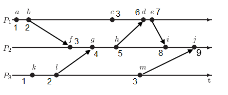
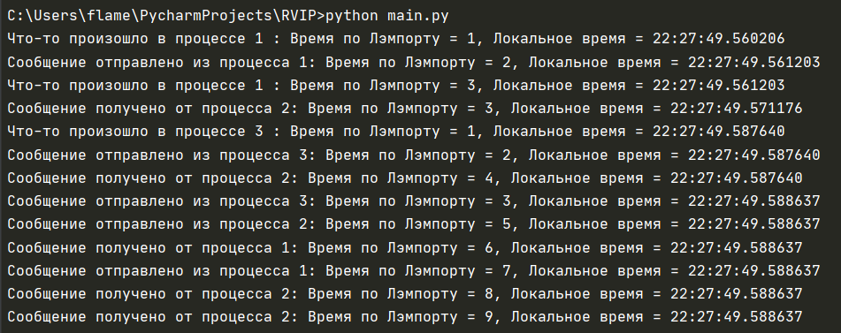

### Черноморченко Алина ПИбд-41

## Задание по лекции 27.10.2021 РВИП

 
   
Схема взаимодействия процессов

 
Вывод в консоль  
   
 
Реализован алгоритм логических часов Лэмпорта

Часы Лэмпорта — простой алгоритм определения порядка событий в распределённой системе. В связи с отсутствием возможности полностью синхронизировать все узлы - вводится отношение частичного порядка с минимальными затратами, метод является прообразом метода векторных часов.

Лесли Лэмпорт разработал механизм, при использовании которого отношение порядка задаётся одним числом. Часы Лэмпорта монотонно увеличивают счётчик каждого процесса согласно определенным правилам.

Программа состоит из трех файлов:
main.py, processes.py и service.py

